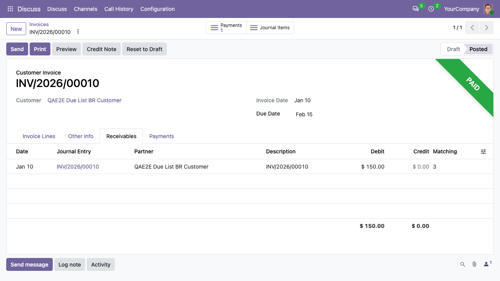
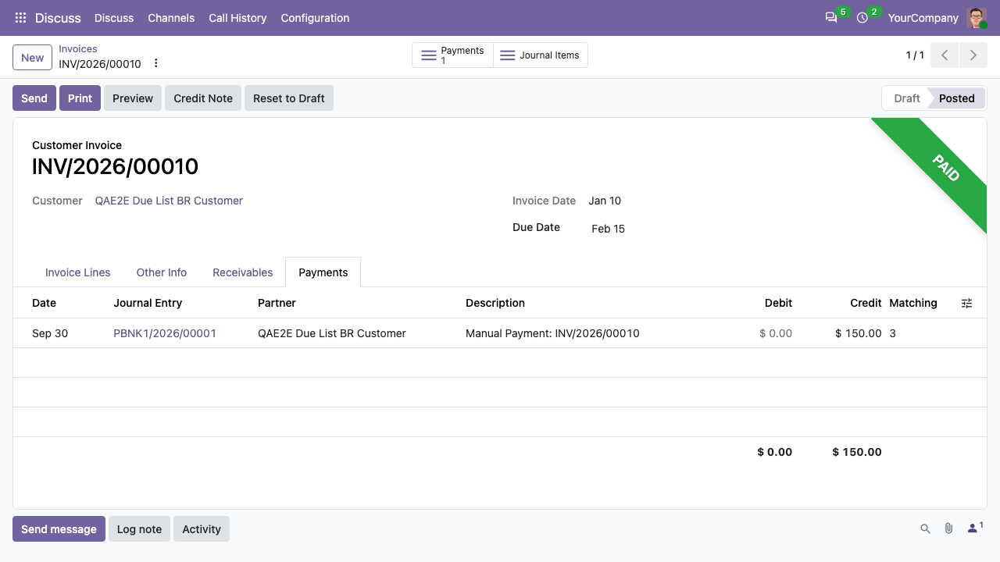

Open any posted invoice (Invoicing > Customers > Invoices, or Invoicing >
Vendors > Bills). The invoice form has two extra tabs:

- Receivables in the case of customer invoices and Payables in the case of
  vendor bills: the installments (payment term lines) of the invoice, with
  due date and amount.

  

- Payments: the journal items of the payments reconciled with the invoice.

  
