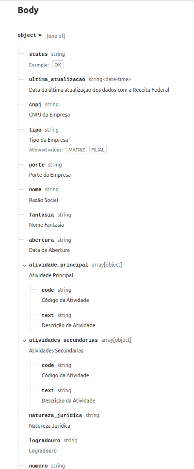
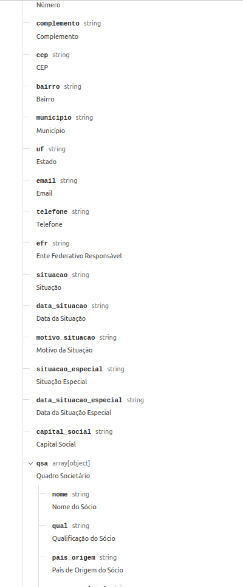
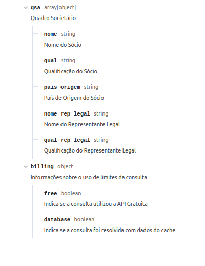
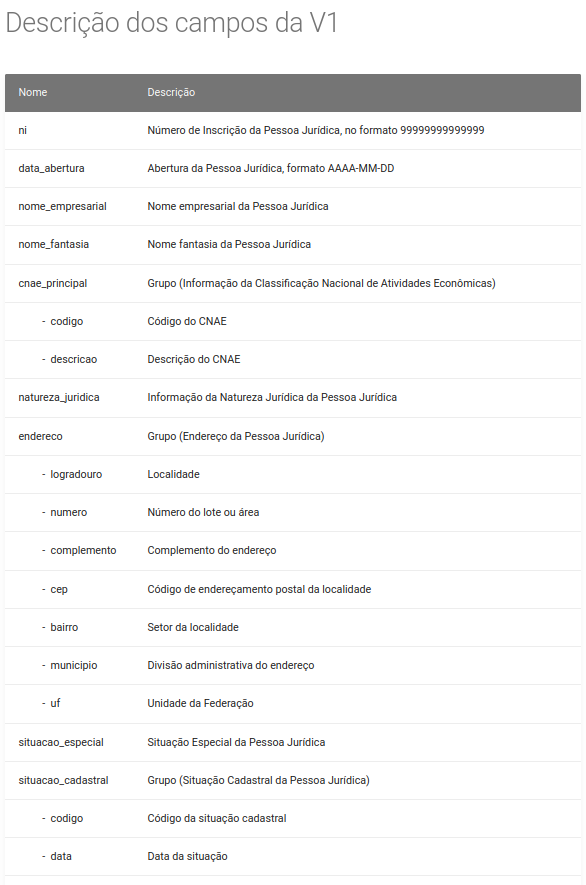
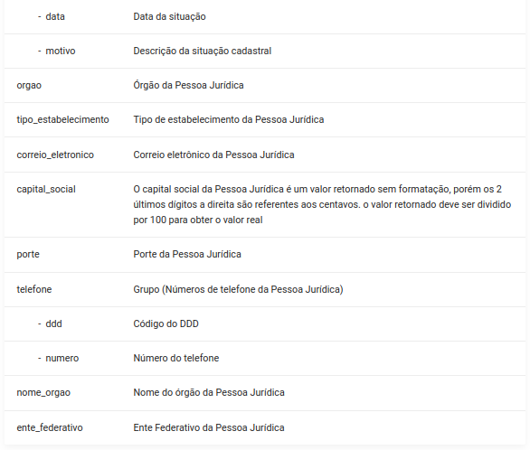

Módulo que adiciona um botão para preencher automaticamente os campos de
um partner a partir do seu CNPJ. Seguem abaixo os campos que podem ser
consultados de ambas as APIs utilizadas para conseguir informações a
partir do CNPJ:

## ReceitaWS

## SERPRO

