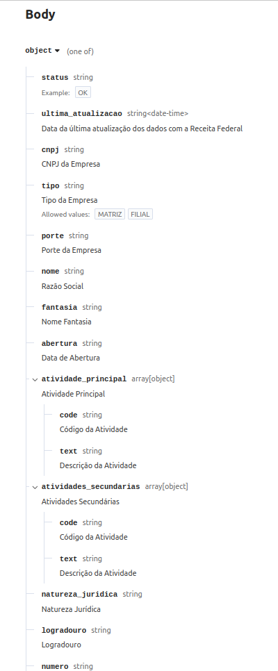
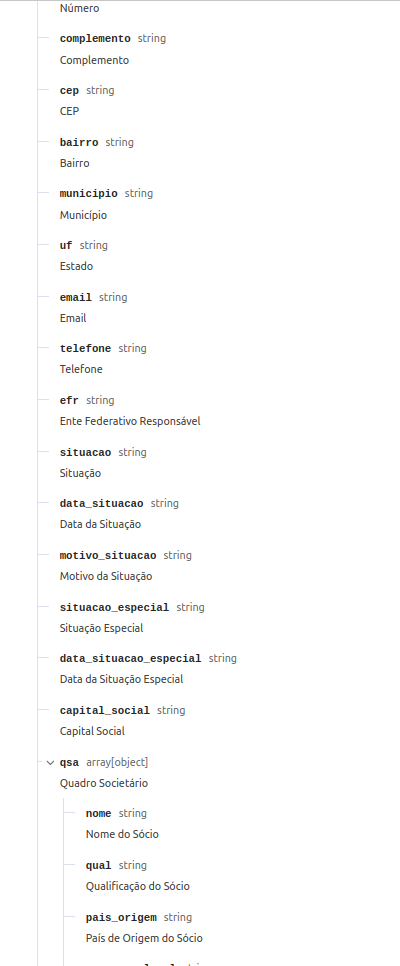
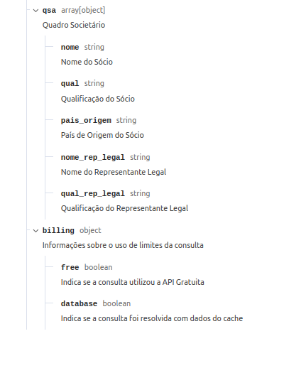
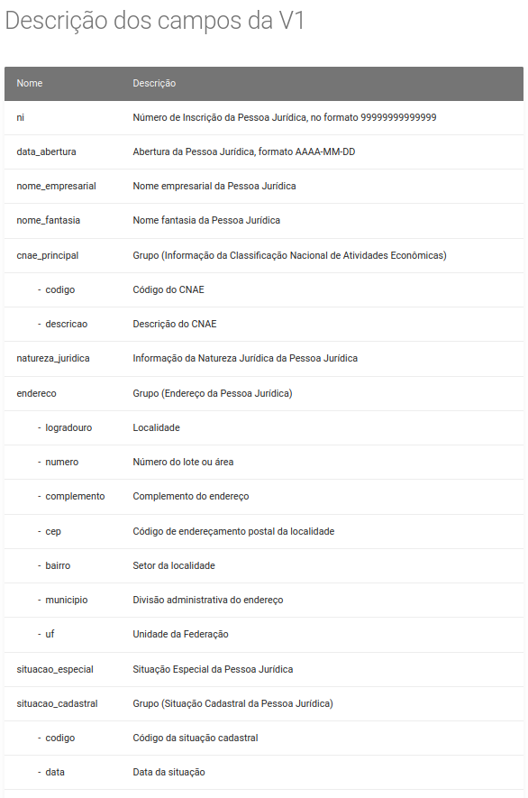
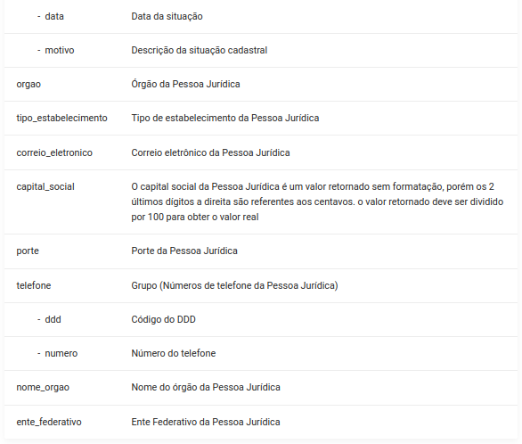

Módulo que adiciona um botão para preencher automaticamente os campos de
um partner a partir do seu CNPJ. Seguem abaixo os campos que podem ser
consultados de ambas as APIs utilizadas para conseguir informações a
partir do CNPJ:

## ReceitaWS

## SERPRO

## CPF.CNPJ (cpfcnpj.com.br)

Provedor comercial com dados em tempo real, vindos da Receita Federal no
momento da consulta (D+0). O pacote 5 (CNPJ B) é a opção mais leve
(cadastro e endereço, sem sócios e sem PDF), enquanto o pacote 6 (CNPJ D)
traz o cadastro completo.

Do pacote 6, o módulo preenche no partner: razão social, nome fantasia,
endereço completo, telefones, e-mail, natureza jurídica, capital social,
CNAE principal e secundários, porte da empresa, situação cadastral (com
data e motivo), data de abertura, matriz ou filial, data de opção pelo
Simples Nacional e responsável perante a Receita (nome e qualificação). A
partir do Simples Nacional, SIMEI e porte, o módulo também alimenta o
`tax_framework` (regime tributário) do partner, campo que os demais
provedores não preenchem hoje.

Cada sócio do Quadro de Sócios e Administradores vira um contato filho e
o Cartão CNPJ em PDF da Receita Federal fica anexado ao parceiro; as
opções "CPF.CNPJ: do not import partners (QSA)" e "CPF.CNPJ: do not attach
the CNPJ card PDF" desligam cada um desses passos. A opção "CPF.CNPJ: fetch state registration (package
16)" (desligada por padrão) faz uma consulta ao pacote 16 (CNPJ H) para
trazer a Inscrição Estadual da UF do endereço.

O provedor mantém as certificações ISO/IEC 27001, ISO/IEC 27701 e ISO
37301. A documentação da API está disponível em
https://www.cpfcnpj.com.br/dev/.
