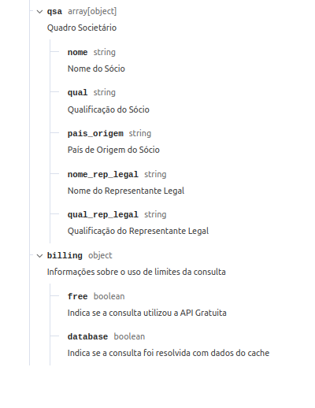
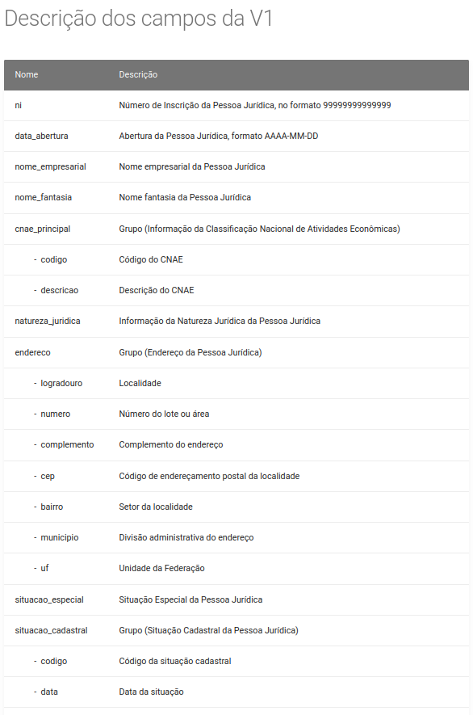
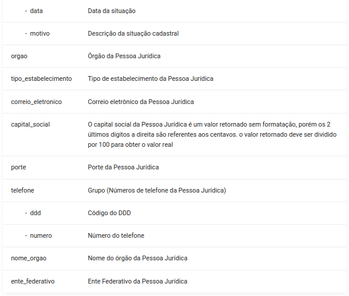

Módulo que adiciona um botão para preencher automaticamente os campos de um partner a partir do seu CNPJ.
Seguem abaixo os campos que podem ser consultados de ambas as APIs utilizadas para conseguir informações a partir do CNPJ:

ReceitaWS
-------------------

.. figure:: ../static/description/receita.png
   :alt: ReceitaWS campos parte 1
   :width: 80 %
   :align: center

.. figure:: ../static/description/receita1.png
   :alt: ReceitaWS campos parte 2
   :width: 80 %
   :align: center

SERPRO
----------------------------------------------

