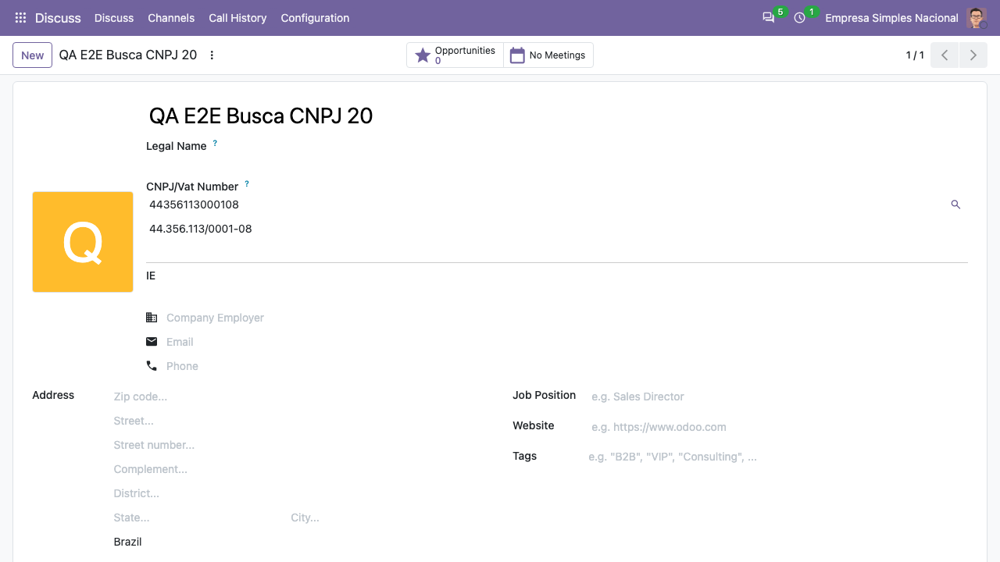
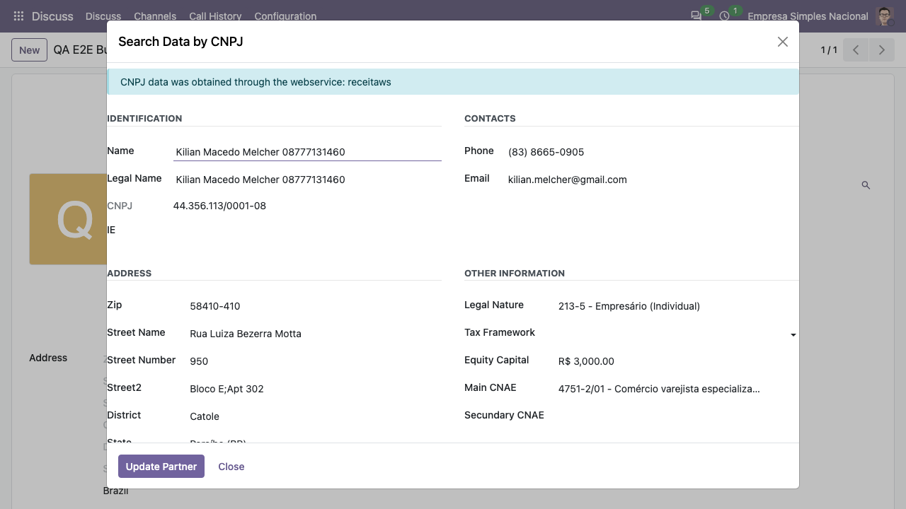
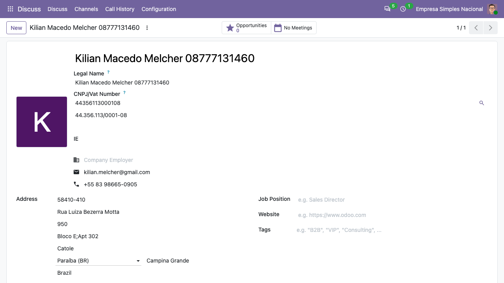

1.  Acesse Configurações
2.  Escolha um provedor para a busca
3.  Acesse Configurações \> Usuários e Empresas \> Empresas \> Criar ou
    acesse Contatos \> Criar
4.  Preencha os campos obrigatórios, insira no campo de CNPJ o CNPJ que
    deseja buscar e clique na lupa ao lado do campo para buscar
5.  O mesmo procedimento pode ser feito editando alguma empresa.

Com o provedor CPF.CNPJ, o botão de busca no parceiro (a lupa ao lado do
campo de CNPJ) abre um wizard que exibe os campos retornados. Ao
confirmar, o módulo grava os dados no parceiro, cria um contato filho por
sócio do Quadro de Sócios e Administradores (opção QSA) e anexa o Cartão
CNPJ em PDF na aba "Anexos".

Na tela (Odoo 20.0): a lupa fica ao lado do CNPJ no cadastro do contato.

O assistente mostra os dados devolvidos pelo provedor:

Em **Update Partner**, os dados são gravados no contato:

