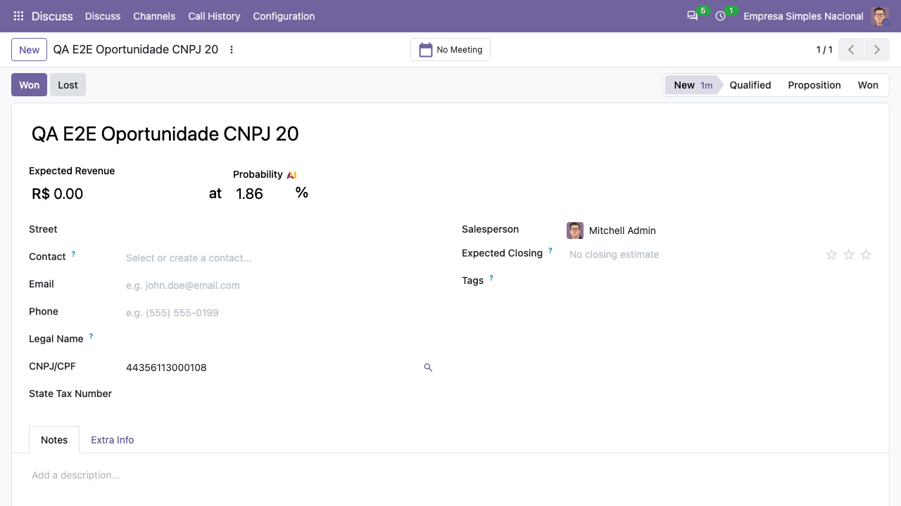
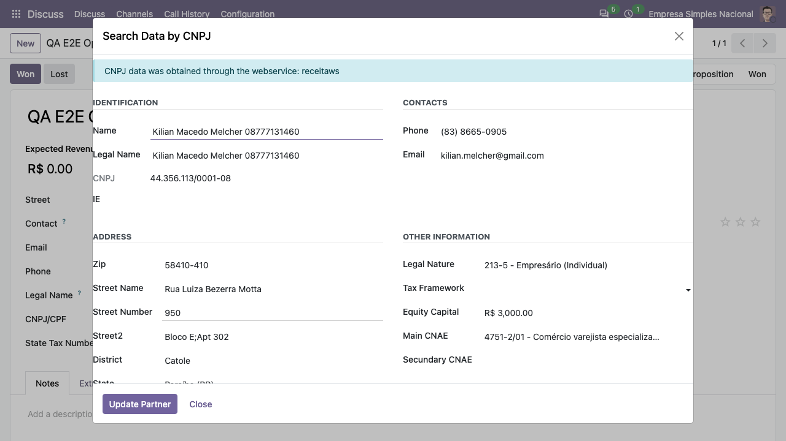
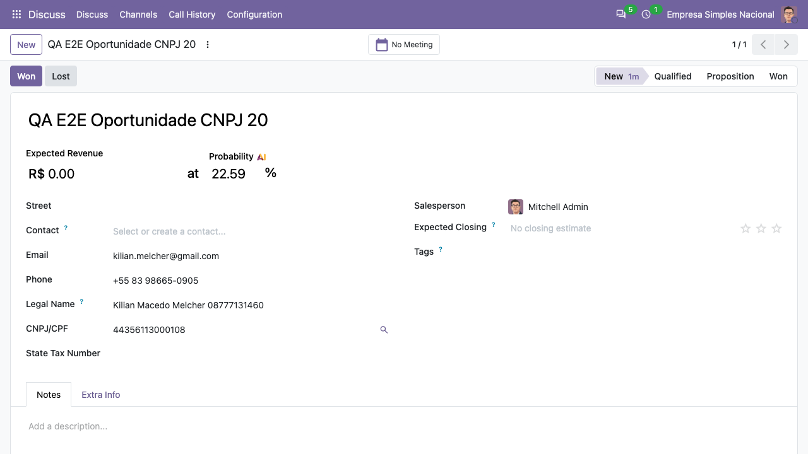

1.  Acesse Configurações
2.  Escolha um provedor para a busca
3.  Habilite o Lead nas configurações do CRM
4.  Acesse CRM \> Lead \> Criar
5.  Preencha o nome do Lead, insira no campo de CNPJ o CNPJ que deseja
    buscar e clique na lupa ao lado do campo para buscar
6.  Confira os dados no assistente e clique em **Update Partner**: razão
    social, endereço, telefone e e-mail vão para o Lead/oportunidade, e a
    natureza jurídica, o capital social e os CNAEs vão para a aba **Extra
    Info**. Ao converter o Lead, o cliente criado recebe esses dados.

Na tela (Odoo 20.0), a lupa fica ao lado do CNPJ/CPF da oportunidade:

O assistente mostra os dados devolvidos pelo provedor:

Depois de **Update Partner**:

