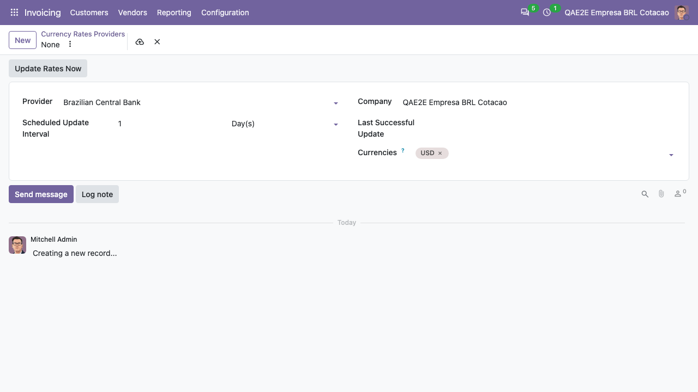

The Brazilian Central Bank service only works for companies whose currency
is the Brazilian Real (BRL).

To enable the automatic update of the currency rates:

- Go to *Invoicing > Configuration > Settings*
- Check the option *Automatic Currency Rates (OCA)*

To configure the provider:

- Go to *Invoicing > Configuration > Accounting > Currency Rates Providers*
- Create a provider and choose the service *Brazilian Central Bank*
- Select the currencies you want to update (the Central Bank publishes AUD,
  CAD, CHF, DKK, EUR, GBP, JPY, NOK, SEK and USD)

