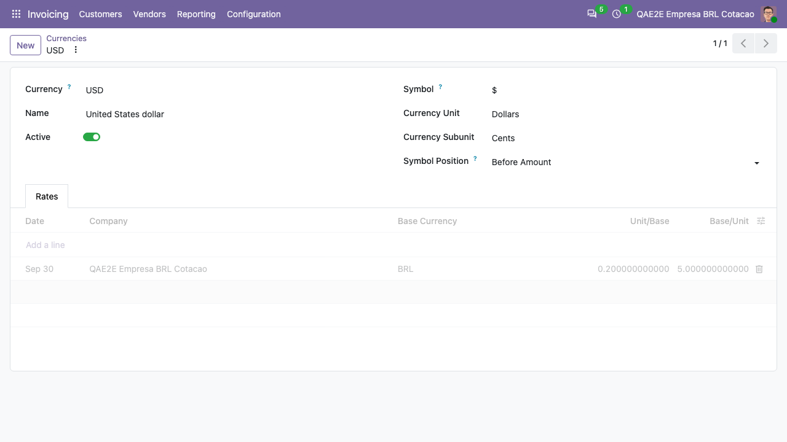

To update the currency rates right away, for example to load historical
rates:

- Go to *Invoicing > Configuration > Accounting > Currency Rates Providers*
- Open the provider (or select it in the list and use *Actions > Update
  Currency Rates*) and click *Update Rates Now*
- Set the date interval and click *Update*

The rate stored for each day is the inverse of the selling quotation
(*cotacaoVenda*) of the last bulletin of the day. The rates show up in the
*Rates* tab of each currency:

