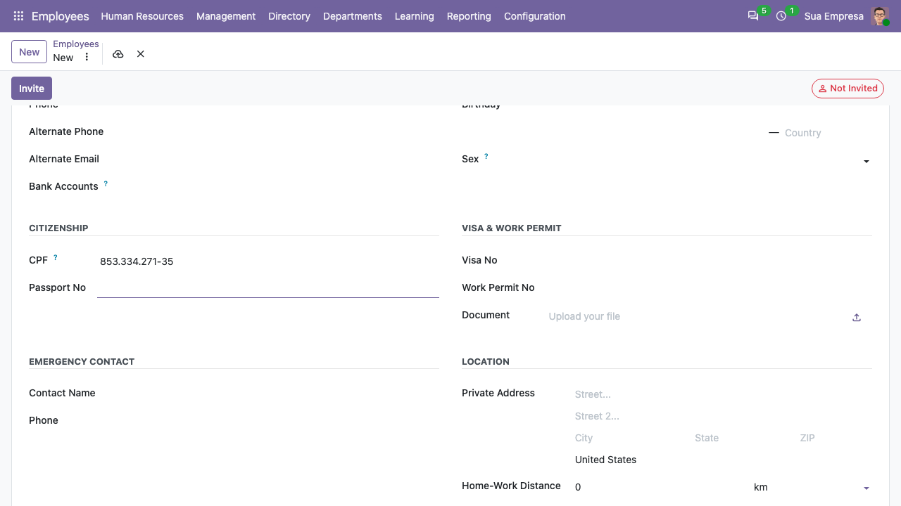
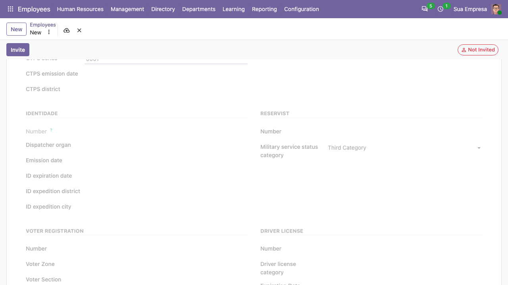

Go to *Employees* and create or open an employee:

- In the *Personal* tab the CPF replaces the *Identification No* field. It
  is validated, and formatted while you type (85333427135 becomes
  853.334.271-35). The birth city and the ethnicity are also there.

  

- The *Documents* tab holds the CTPS, civil certificate, RG, reservist,
  voter registration, driver license, PIS/PASEP (validated) and the names
  of the parents.

  

- The *Health* tab holds the blood type and the deficiency.
