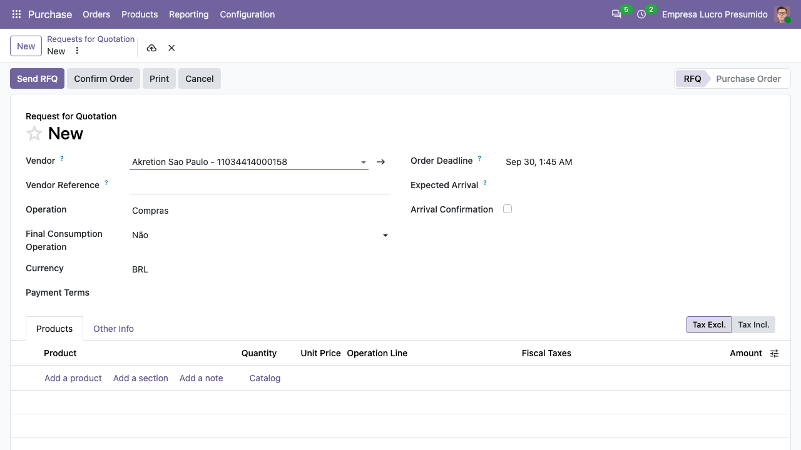
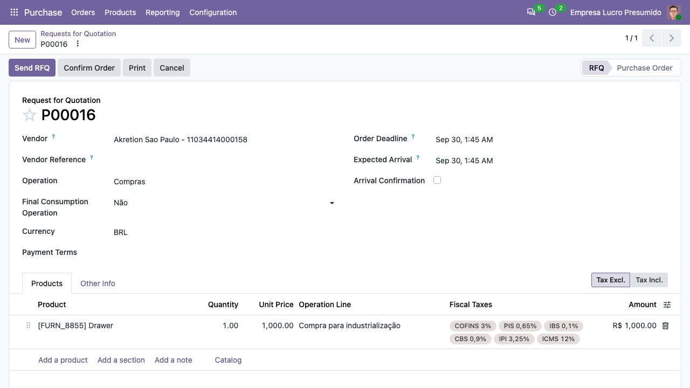
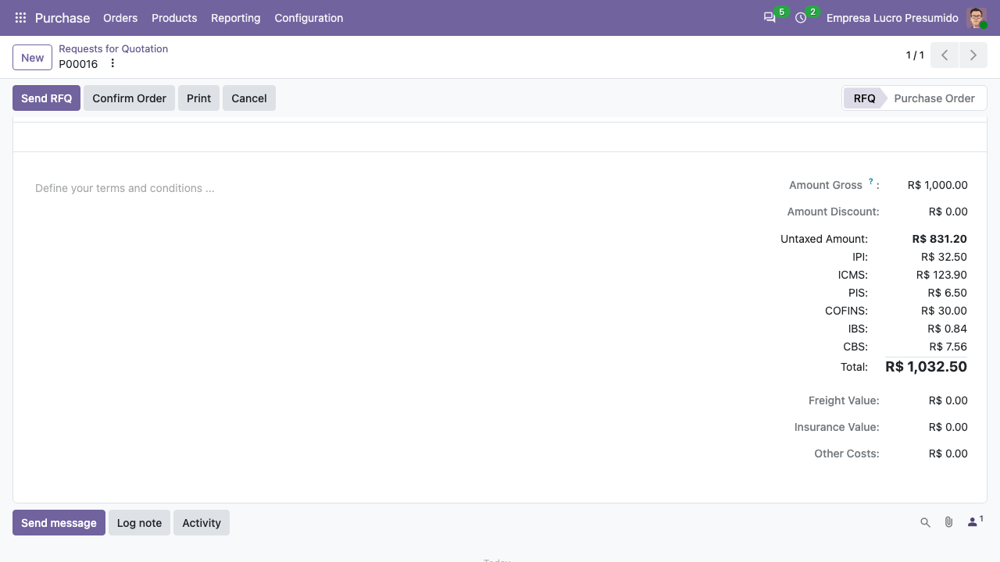

Ao criar uma solicitação de cotação (*Compras > Pedidos > Solicitações de
cotação*) numa empresa brasileira, o cabeçalho mostra a **Operação** fiscal
(padrão da empresa, por exemplo "Compras") e o consumidor final:

Cada linha resolve a linha da operação fiscal e exibe os tributos fiscais
calculados (ICMS, IPI, PIS, COFINS, IBS, CBS):

Os totais mostram os impostos da compra, o total e os valores de frete,
seguro e outros custos:

