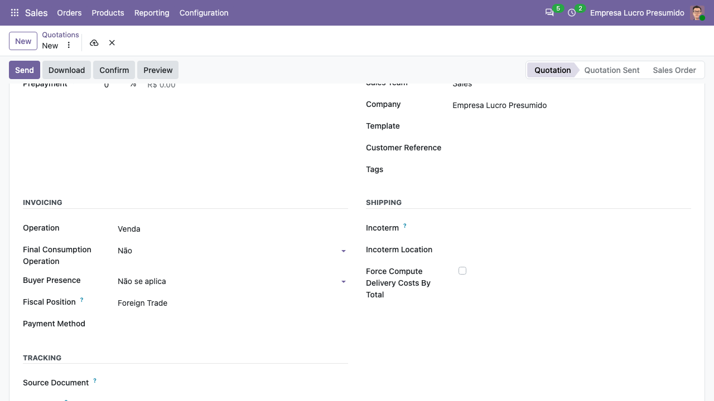
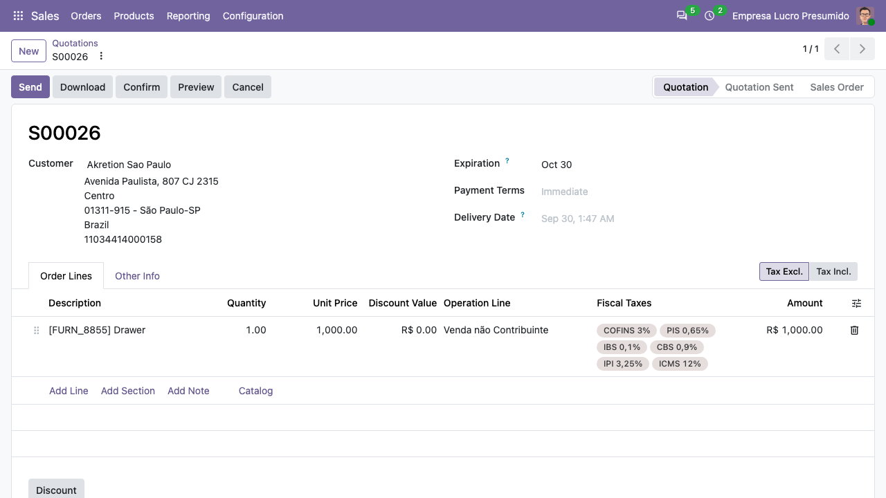
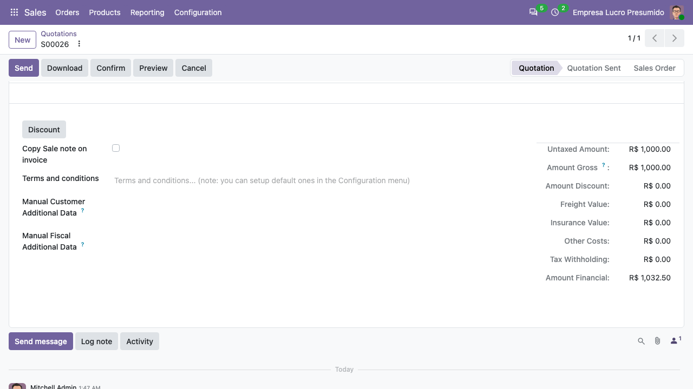

Após configurar a empresa, os dados contábeis e fiscais, ao criar um
pedido de venda (*Vendas > Pedidos > Cotações*) numa empresa brasileira, a
aba **Other Info** mostra, no grupo de faturamento, a **Operação** fiscal
(padrão da empresa), o consumidor final e a presença do comprador:

Ao adicionar um produto ou serviço, a linha resolve a linha da operação
fiscal e exibe os tributos fiscais calculados (ICMS, IPI, PIS, COFINS, IBS,
CBS):

Os totais do pedido mostram o valor bruto, o desconto, frete, seguro, outros
custos, as retenções e o valor financeiro (com os impostos por fora, como o
IPI):

