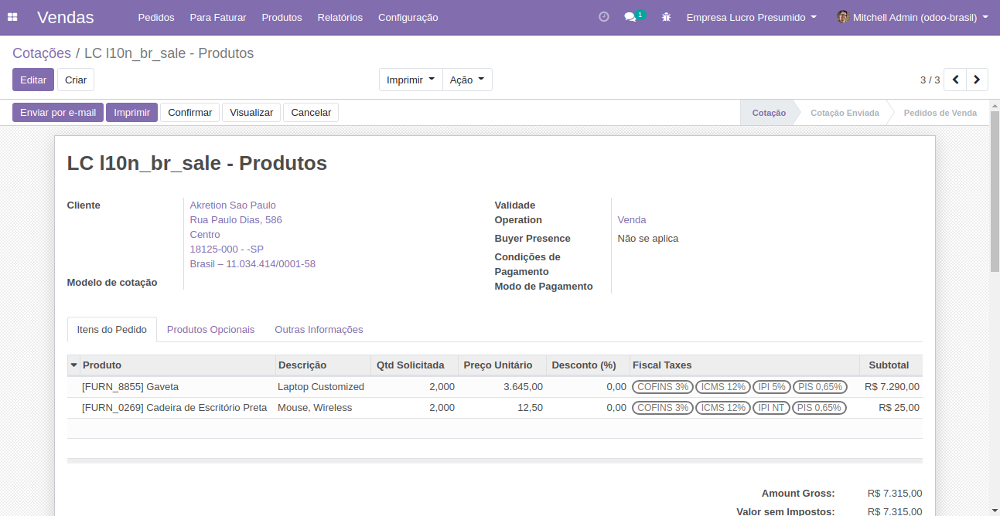
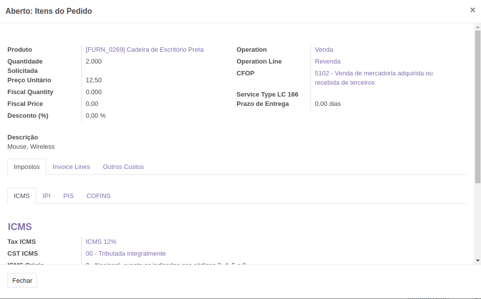

Após configurar a empresa, os dados contábeis e fiscais, ao criar um
pedido de venda será, será possível visualizar os dados fiscais e
contábeis:

Ao adicionar um produto ou serviço será exibido os detalhes dos
impostos:

