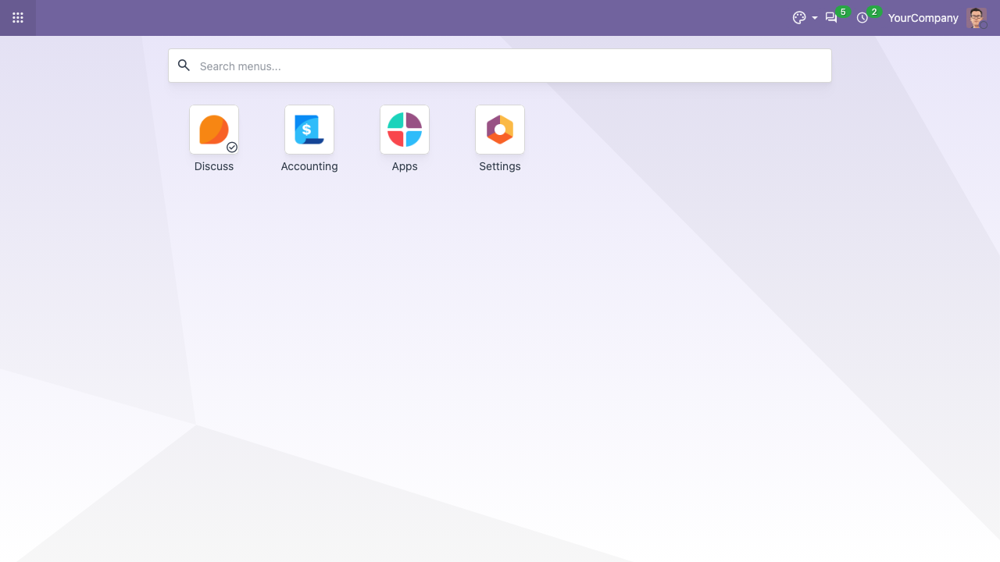
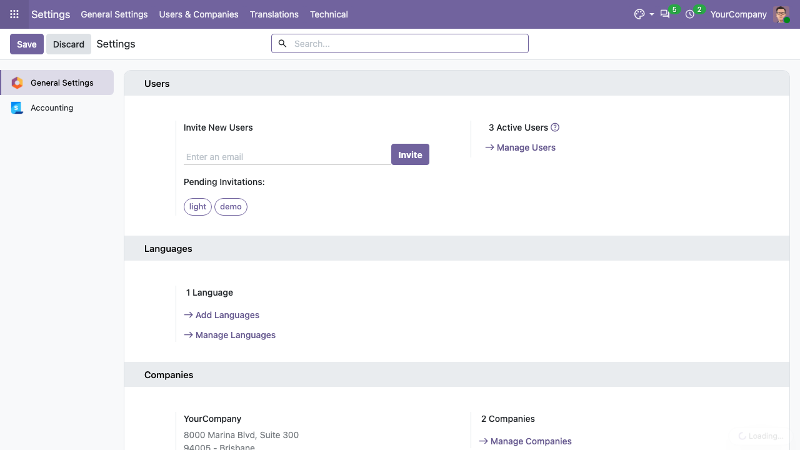

This module has no screens of its own. Installing it installs the usability
modules the Brazilian localization expects to find in every database:

- ``web_responsive``: the applications menu opens as a full screen grid with a
  search box.

  

- ``base_technical_features``: with *Technical Features* checked in the user
  preferences, the technical menus (for instance *Settings > Technical*) show up
  without activating the debug mode.

  

- ``account_usability``: exposes the accounting menus hidden in Odoo Community,
  such as the account tags used by the Brazilian charts of accounts.
- ``account_reconcile_oca``: the bank statement reconciliation screen.
