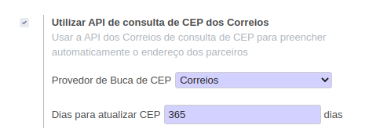

Nas configurações gerais no grupo de  **Localização Brasileira** pode ser habilitada ou desabilitada a busca de CEP

Ao habilitar a busca de CEP existe as configurações:

* Provedor de Busca de CEP;
* Periodo para um registro na l10n_br_zip ser atualizado em uma nova consulta.
