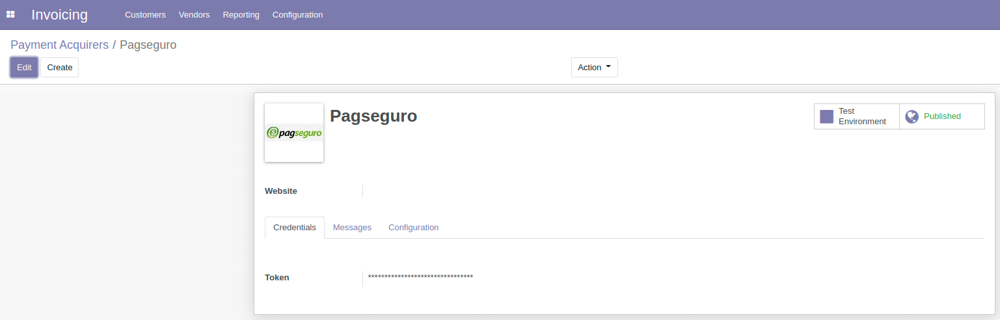
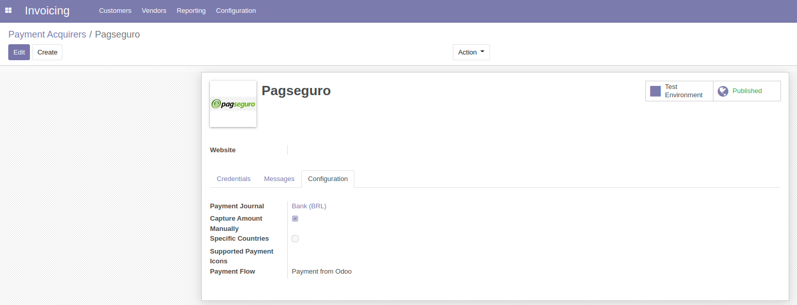
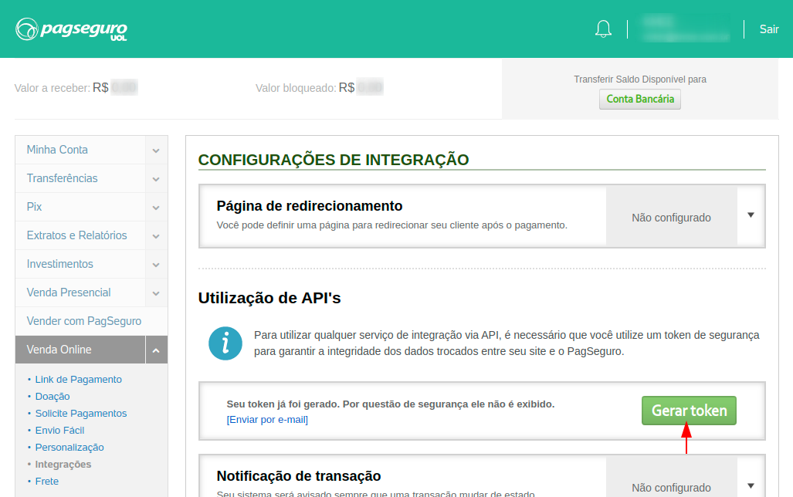

This module will require registering in eCommerce PagSeguro https://acesso.pagseguro.uol.com.br/

To configure your API keys go to Invoicing -> Configuration -> Payment Acquirers -> PagSeguro.
Then insert your token on the credentials page, as shown below:

Under the configuration page, select your payment journal.
On the upper right corner buttons you can publish on your website and change the environment.

The credential Token and can only be acquired via the PagSeguro user account.
On your account, go to "Venda Online" > "Integrações". Then, click on "Gerar Token".

* full manual for API:

https://dev.pagseguro.uol.com.br/reference/pagseguro-reference-intro
