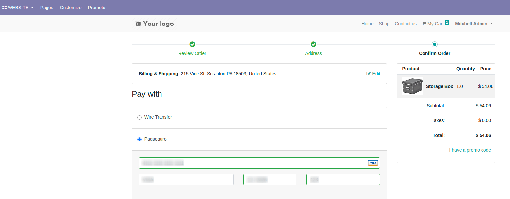

After the configuration, you can go to the website module, and buy a product
in your website shop by selecting the Pagseguro payment method and adding your
credit card information. Then, click on the pay now button.

