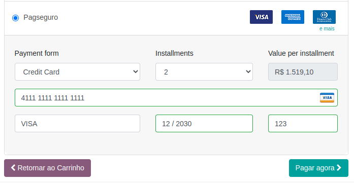

After the configuration, you can go to the website module, and buy a product
in your website shop by selecting the Pagseguro payment method.

Here you can select:
  - Payment form (there is only credit card so far).
  - Amount of installments you want to pay (notice than the maximum value you can select is based on your acquirer configuration).

When selecting the installments you can see the value of each installment on
the input field on the right.

After that, insert you Card number, name, expiration date and security code.
Then, click on the pay now button.

So far, we support only VISA, MasterCard, American Express and Diners brands.

**notice**: The credentials that we use in this image are not from a real card,
instead this is a test card given by the Pagseguro for test purposes.
You can find more tests cards here https://dev.pagseguro.uol.com.br/reference/testing-cards.
